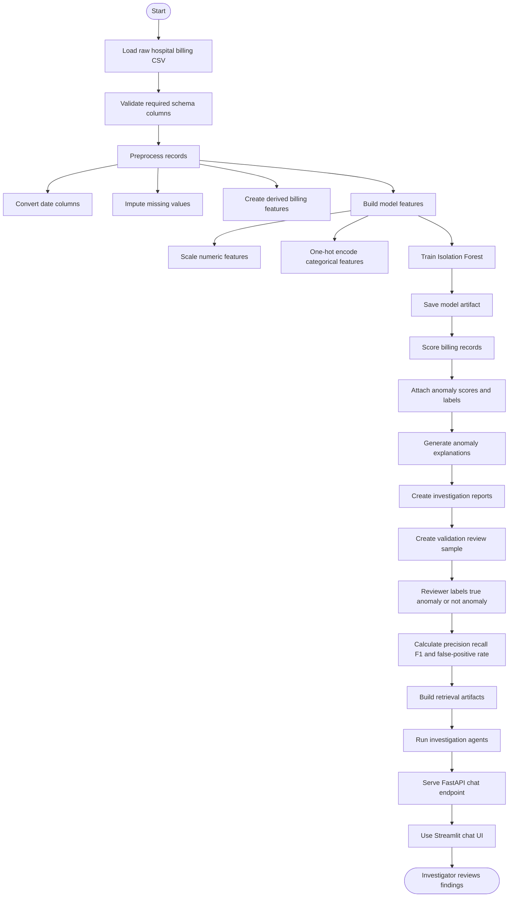

# Hospital Billing AI Investigation Assistant

## Project Summary

This capstone project converts an exploratory hospital billing anomaly detection notebook into a reusable AI-assisted investigation platform. The system ingests hospital billing data, cleans and engineers features, trains an unsupervised anomaly detection model, scores billing records, explains flagged cases, and exposes investigation workflows through API and UI layers.

The original notebook is preserved as a research artifact:
- `Anomaly detection .ipynb`
- `notebooks/anomaly_detection.ipynb`

The production-oriented implementation is organized under `src/` and supported by processed data outputs, tests, configuration, a FastAPI service, and a Streamlit chat interface.

## Objectives

- Detect unusual hospital billing records without requiring labeled fraud/anomaly data.
- Provide human-readable explanations for records flagged by the model.
- Support investigator questions through retrieval and agent-based workflows.
- Refactor notebook logic into maintainable Python modules.
- Keep the workflow reproducible through configuration, scripts, artifacts, and tests.

## Dataset

Primary dataset:
- Raw data: `data/raw/Hospital_billing.csv`
- Original root-level copy: `Hospital_billing.csv`

Important columns:
- Patient and visit: `patient_id`, `age`, `gender`, `visit_date`, `visit_type`, `visit_reason`
- Clinical context: `department`, `physician_id`, `diagnosis`, `is_emergency`
- Billing and payer: `payer_name`, `payer_type`, `claim_status`, `insurance_id`
- Financial values: `charge_amount_USD`, `payment_amount_USD`
- Admission timeline: `admission_date`, `discharge_date`

Processed outputs:
- Cleaned data: `data/processed/billing_cleaned.csv`
- Scored data: `data/processed/billing_scored.csv`
- Investigation reports: `data/processed/anomaly_reports.jsonl`
- Reviewer labels: `data/processed/anomaly_review_labels.csv`

## Current Architecture

```text
Raw Billing CSV
      |
      v
Schema Validation and Data Loading
      |
      v
Preprocessing and Feature Engineering
      |
      v
Isolation Forest Model
      |
      v
Anomaly Scores and Labels
      |
      v
Explanation Engine
      |
      v
RAG Retrieval and Investigation Agents
      |
      v
FastAPI Chat Endpoint / Streamlit Chat UI
```

## Module Overview

| Area | Files | Responsibility |
| --- | --- | --- |
| Ingestion | `src/ingestion/load_data.py` | Load CSV data and validate required schema columns. |
| Preprocessing | `src/preprocessing/preprocess.py` | Convert dates, impute missing values, normalize text, create derived billing features. |
| Feature engineering | `src/features/feature_engineering.py` | Select model features, scale numeric columns, and one-hot encode categorical columns. |
| Modeling | `src/models/train_isolation_forest.py` | Train and persist the Isolation Forest pipeline. |
| Prediction | `src/models/predict.py` | Load the trained model, score records, and attach anomaly labels. |
| Explanation | `src/anomaly/anomaly_explainer.py` | Compare anomalies to department baselines and generate readable explanations. |
| Evaluation | `src/evaluation/validation.py` | Create review samples and compute precision, recall, F1, and false-positive rate from reviewer labels. |
| RAG | `src/rag/` | Create and query retrieval artifacts from anomaly reports. |
| Agents | `src/agents/` | Coordinate retrieval, investigation, and recommendation behavior. |
| API | `src/api/app.py` | Serve health and chat endpoints with FastAPI. |
| UI | `src/ui/streamlit_app.py` | Provide a Streamlit chat interface for investigators. |
| Tests | `tests/test_pipeline.py` | Validate training, prediction, and explanation flow. |

## Modeling Approach

The project uses `IsolationForest` for unsupervised anomaly detection. This is appropriate for an early-stage billing anomaly workflow because known anomaly labels are not required.

Model input features include:

Numerical:
- `age`
- `payment_amount_USD`
- `charge_amount_USD`
- `length_of_stay_days`
- `payment_ratio`
- `unpaid_amount_USD`

Categorical:
- `department`
- `diagnosis`
- `visit_reason`
- `is_emergency`
- `claim_status`
- `visit_type`
- `gender`

Current model configuration in `config.yaml`:
- Contamination: `0.05`
- Random state: `42`
- Model artifact: `src/models/model.pkl`

## Explanation Logic

Flagged records are explained using department-level baselines and billing signals. The explainer highlights patterns such as:
- charges materially above department averages,
- positive charges with no recorded payment,
- denied or rejected claim statuses,
- unusual combined feature patterns relative to peer records.

These explanations are intended to assist manual review, not replace investigator judgment.

## API and UI

FastAPI app:
- Health check: `GET /health`
- Chat endpoint: `POST /chat`

Example request:

```http
POST /chat
{
  "question": "Why was patient 154669 flagged?"
}
```

Streamlit app:

```bash
streamlit run src/ui/streamlit_app.py
```

## Reproducible Workflow

Install dependencies:

```bash
pip install -r requirements.txt
```

Train the model and save cleaned data:

```bash
python -m src.models.train_isolation_forest
```

Score billing records:

```bash
python -m src.models.predict
```

Create retrieval artifacts:

```bash
python -m src.rag.create_embeddings
```

Create a validation review sample:

```bash
python -m src.evaluation.validation --mode sample
```

After reviewers update `reviewer_label` values in `data/processed/anomaly_review_labels.csv`, calculate validation metrics:

```bash
python -m src.evaluation.validation --mode evaluate
```

Run the API:

```bash
uvicorn src.api.app:app --reload
```

Run tests:

```bash
pytest
```

## Current Findings

- The original notebook established the exploratory analysis and demonstrated that `charge_amount_USD` is the central signal for anomaly investigation.
- The refactored pipeline now adds schema validation, reusable preprocessing, model persistence, prediction output, explanation generation, and chat-based investigation support.
- The evaluation module now creates a balanced review sample from flagged, normal, and random records so domain reviewers can establish ground truth labels.
- Once records are labeled as `true_anomaly`, `not_anomaly`, or `needs_review`, the project can calculate precision, recall, F1 score, and false-positive rate.
- The anomaly model is still unsupervised, so results should be validated with domain review before operational use.
- The current system is best understood as an investigation assistant: it prioritizes records and explains why they may deserve review.

## Limitations

- Ground truth labels are not inherent in the source dataset; they must be created through the review sample workflow.
- Model performance metrics depend on reviewer completion of `data/processed/anomaly_review_labels.csv`.
- The contamination value is fixed at `0.05` and should be calibrated with business feedback.
- Explanations are rule-guided and baseline-based; they do not prove fraud or billing error.
- Deployment, monitoring, access control, and audit logging still need to be defined for production use.

## Recommended Next Steps

1. Create a labeled validation sample through manual review of flagged and non-flagged records.
2. Evaluate anomaly quality by department, diagnosis, claim status, and payer type.
3. Calibrate the contamination threshold based on investigator capacity and review precision.
4. Add monitoring for anomaly rate, charge distribution drift, claim denial rate, and payment ratio shifts.
5. Add stronger auditability around investigation outputs, including timestamps, reviewed-by fields, and final disposition.
6. Expand tests to cover API behavior, retrieval behavior, and edge cases in preprocessing.
7. Consider comparing Isolation Forest against Local Outlier Factor, robust statistical rules, and supervised models if labels become available.

## Project Flow


